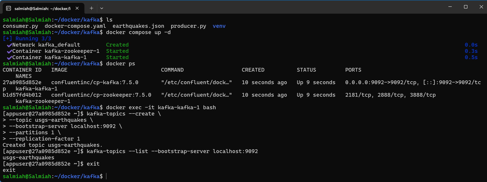
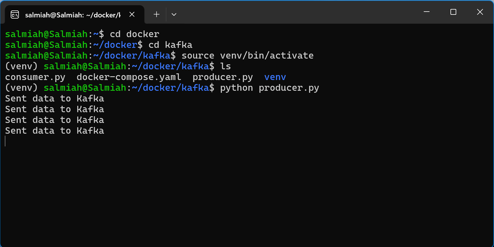
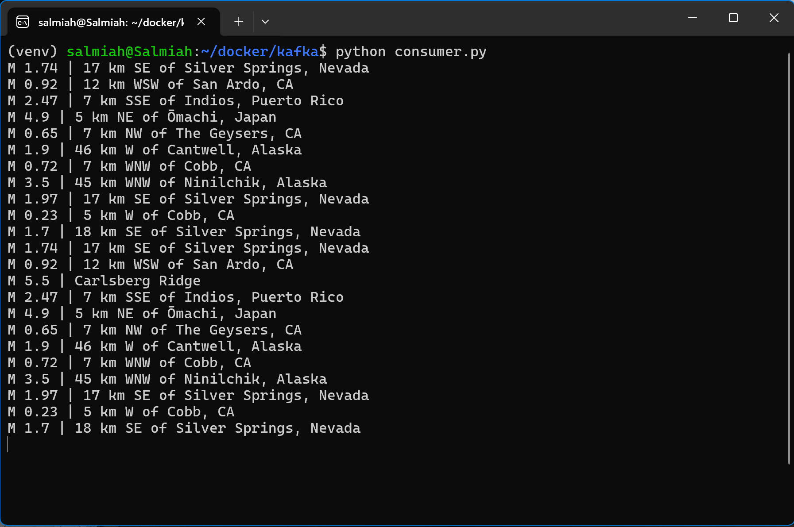

### USGS Earthquake Dashboard built with Streamlit/Python

Link to dashboard: https://salmiahls-usgs-earthquake-dashboard.streamlit.app/

### USGS Earthquake Streaming Pipeline with Kafka (built with Docker) 
<figure>
  
  <figcaption>Create Kafka topic with Docker</figcaption>
</figure>
  
<figure>
  
  <figcaption>Example output of producer.py</figcaption>
</figure>
  
<figure>
  
  <figcaption>Example output of consumer.py</figcaption>
</figure>
